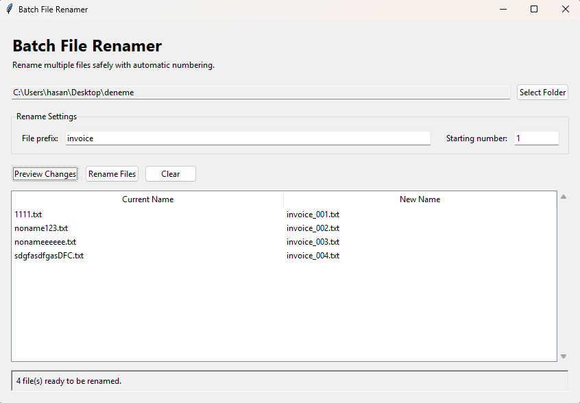

# Python Automation Toolkit

A collection of practical Python tools designed to automate repetitive tasks, process files, and simplify everyday business workflows.

## Available Tools

### Batch File Renamer

A simple desktop application for safely renaming multiple files with automatic numbering.

#### Features

- Select any folder from the application
- Preview changes before renaming
- Preserve original file extensions
- Choose a custom file prefix
- Set the starting number
- Detect possible naming conflicts
- Display confirmation and completion messages



#### How to Run

1. Download or clone this repository.
2. Open the `file_tools` folder.
3. Run:

```bash
python batch_file_renamer.py
